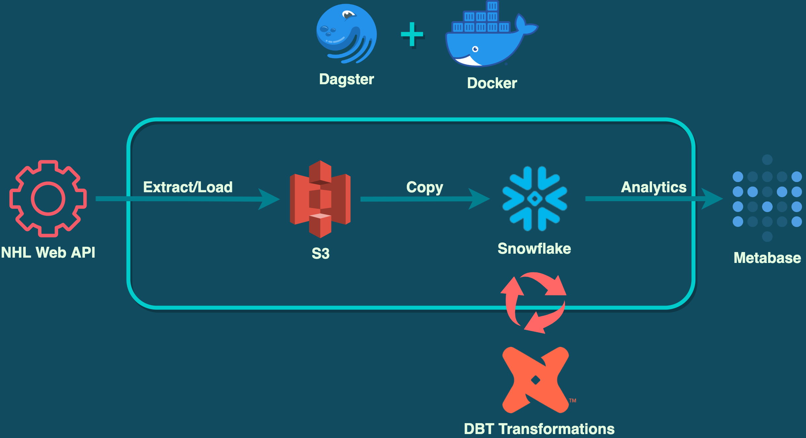

## 🧠About 

### Prerequisites
What things you need to install the software and how to install them.

## Archictecture

## 🚀 Deployment 
Add additional notes about how to deploy this on a live system.

## ⛏️ Built Using 
- [Dagster](https://dagster.io/) - Orchestration
- [dbt](https://www.getdbt.com/) - Transformation & Documentation
- [Snowflake](https://www.snowflake.com/) - Data Warehouse
- [AWS S3](https://aws.amazon.com/) - Storage
- [GitHub Actions](https://docs.github.com/en/actions) - CI/CD
- [Metabase](https://www.metabase.com/) - Data Viz